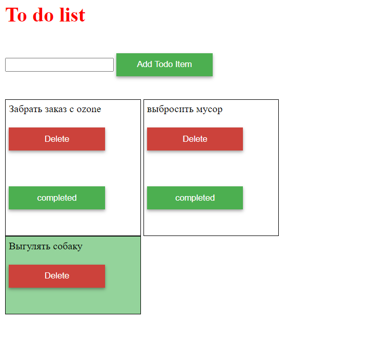

# Приложение список дел
В приложении можно добавлять задачи (дела), которые вы планируете выполнить. При добавлении новой задачи, она отображается ниже в списке. Также, каждую задачу можно отметить как выполненную, нажав кнопку “completed”, что перемещает задачу в другой список, и задача подсвечивается зеленым цветом, или можно удалить задачу, нажав кнопку "Delete", это удалит задачу из любого из списков.
